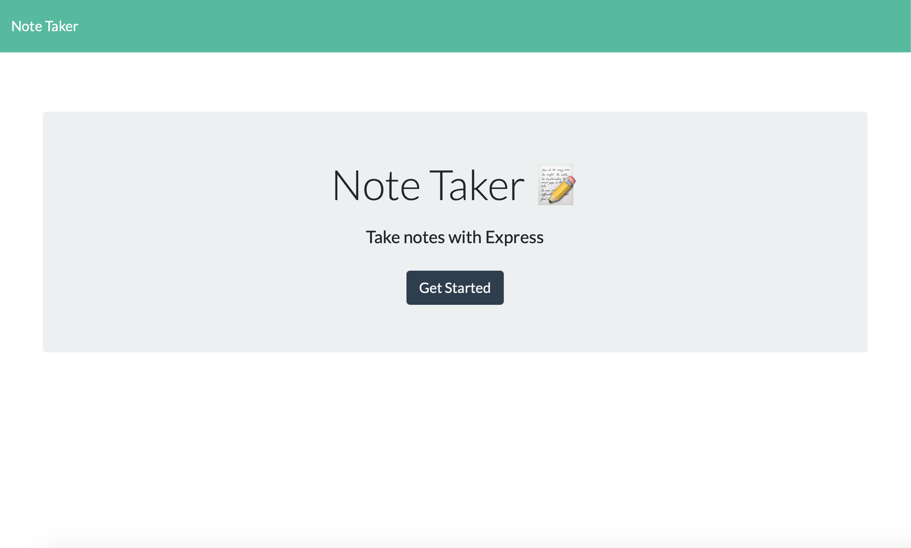
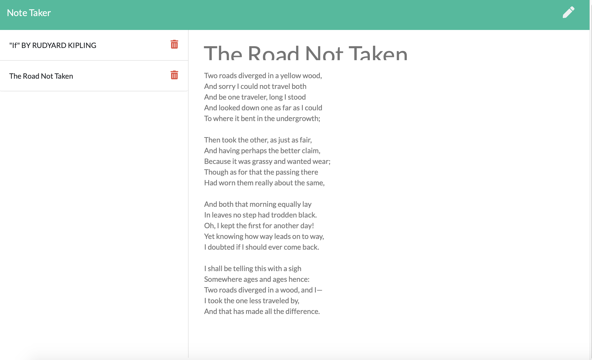
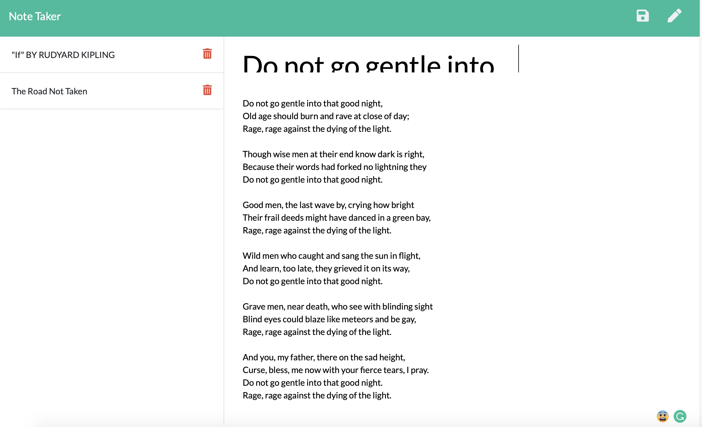

# note-taker

<p align="center">
  
  
  
</p>

[](https://opensource.org/licenses/MIT)

##Table of Contents
* [Description](#description)
* [Installation](#installation)
* [Usage](#usage)
* [Questions](#questions)
* [License](#license)

<br>

## Description
This a a software that generate a team member summary through command line application. This application prompt user for information about the team manager and then information about the team members, whihc can be engineers or interns. This application also contain unit test to ensure successful operation of the constructors and classes in lib folder. When user finished inputing all team member information, a nicely formatted team roster will be writen to an HTML file in the output folder and ready for display in browser.

Please click [here](https://youtu.be/hxyNzYUofbI) to check out the application!
<br>

## Installation
Please see the following command in order to use this application:<br>
```bash
npm i  
node server 
```

## Usage
Please see the following instructions on how to use this application: <br>
⭐open the heroku application<br>
⭐click on the "Get Start" button to start taking note<br>
⭐click on the pencil icon to start new note<br>
⭐click on the save icon upon finising writing your note<br>
⭐Your old saved note will display on the left are will remain accessible<br>
⭐You can click the trash icon to delete any saved note<br>

### Here is a screen shot of how the application should look like




<br>

## Questions?
Feel free to check out my github profile [here](https://github.com/)!
Should you have any questions, you may reach me by e-mail at: alice.wu216@gmail.com

## License
[MIT](https://choosealicense.com/licenses/mit/#)
